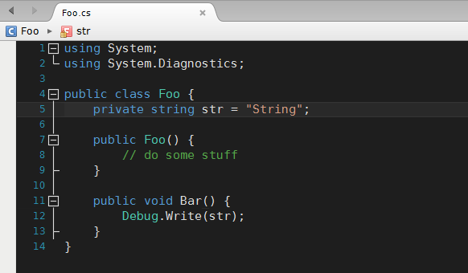

# VS2013 Dark Theme for MonoDevelop
### How to Install
1. Open MonoDevelop
2. Go to Tools > Options > Text Editor > Syntax Highlighting
3. At the bottom of the window, click "Add"
4. Browse to the VS2013-Dark.xml file and double-click it
5. Select it in the list and click OK

